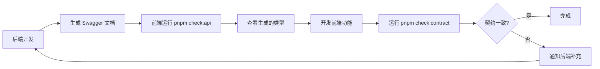

# 前后端 API 契约一致性开发流程

> **核心原则**: 契约优先，类型即文档，自动化检查

## 🎯 目标

解决前后端开发中的常见问题：
- ❌ 前端不知道后端提供了哪些 API
- ❌ 后端不知道前端需要哪些字段
- ❌ 修改 API 后忘记通知对方
- ❌ 类型定义与实际 API 不一致

## 🔄 标准开发流程

### 场景 1: 开发新功能



**具体步骤**：

#### 后端开发者
1. ✅ 使用 **英文** `@ApiTags('customers')`
2. ✅ 使用 `@ApiQuery()` 定义查询参数
3. ✅ 确保 DTO 字段完整
4. ✅ 运行 `pnpm run start:dev` 启动服务
5. ✅ 运行 `pnpm check:api` 检查 Swagger 文档
6. ✅ 通知前端："API 已就绪"

#### 前端开发者
1. ✅ 运行 `cd frontend && pnpm check:api`
2. ✅ 查看 `src/services/api/<模块>.ts`
3. ✅ 查看 `src/models/<类型>.ts` 了解字段
4. ✅ 在 `src/services/api/index.ts` 中导入新模块（如需要）
5. ✅ 使用 `getScrmApi()` 调用接口
6. ✅ 如缺字段 → 找后端补充

### 场景 2: 修改现有 API

#### 后端修改 API 后
```bash
# 1. 修改 Controller / DTO
# 2. 运行检查脚本
cd backend && pnpm check:api

# 3. 脚本会提示通知前端执行：
cd frontend && pnpm generate:api
```

#### 前端收到通知后
```bash
# 1. 重新生成 API
cd frontend && pnpm generate:api

# 2. 检查类型变化
git diff src/models/

# 3. 更新使用该 API 的代码
# 4. 运行契约对比
cd .. && pnpm check:contract
```

## 🛠️ 可用工具

### 1. 前端 API 检查脚本
```bash
cd frontend && pnpm check:api
```

**功能**：
- ✅ 检查后端是否运行
- ✅ 自动生成 API 客户端
- ✅ 显示当前类型文件数量
- ✅ 提示开发流程
- ✅ 列出常见陷阱

### 2. 后端 API 变更通知
```bash
cd backend && pnpm check:api
```

**功能**：
- ✅ 检查修改的 Controller
- ✅ 验证 Swagger 文档可访问
- ✅ 列出当前所有 API 模块
- ✅ 检查 Tag 命名规范（拒绝中文）
- ✅ 提示前端需要执行的操作

### 3. 契约对比工具
```bash
pnpm check:contract
```

**功能**：
- ✅ 扫描前端实际使用的 API
- ✅ 获取后端提供的所有 API
- ✅ 对比发现不一致
- ✅ 提示修复建议

## 📋 快速参考

### 前端开发者必读

**每次开发前必做**：
```bash
cd frontend && pnpm check:api
```

**查看 API 类型**：
```typescript
// 方式1: 查看生成的 API 文件
// frontend/src/services/api/customers.ts

// 方式2: 查看类型定义
// frontend/src/models/customer.ts

// 方式3: 使用集中导出
import type { Customer, CreateCustomerDto } from '@/types/api'
```

**调用 API 的正确姿势**：
```typescript
import { getScrmApi } from '@/services/api'

// ✅ 正确
const api = getScrmApi()
const customers = await api.customers().customerControllerFindAll()

// ❌ 错误
const customers = await getScrmApi().getCustomers().customerControllerFindAll()
```

### 后端开发者必读

**定义 API 的正确姿势**：
```typescript
// ✅ 正确：使用英文 Tag
@ApiTags('customers')
@Controller('customers')
export class CustomersController {
  @Get()
  @ApiOperation({ summary: '获取客户列表' })
  @ApiQuery({ name: 'page', required: false })
  @ApiQuery({ name: 'pageSize', required: false })
  findAll(@Query() query: CustomerControllerFindAllParams) {
    // ...
  }
}

// ❌ 错误：使用中文 Tag
@ApiTags('客户管理')  // 会导致跨平台问题
```

**修改 API 后必做**：
```bash
cd backend && pnpm check:api
```

## ⚠️ 常见陷阱

### 陷阱 1: 分页数据字段不统一

**问题**：不同 API 返回不同的字段名

```typescript
// 情况 A: 使用 data 字段
{ data: [...], total, page, pageSize }

// 情况 B: 使用 items 字段
{ items: [...], total, page, pageSize }

// 情况 C: 直接返回数组
[...]
```

**解决方案**：
```typescript
// 1. 在浏览器中查看实际响应
// 2. 根据实际字段访问
const data = response?.data || []   // 如果返回 data 字段
const data = response?.items || []  // 如果返回 items 字段
const data = response || []         // 如果直接返回数组
```

### 陷阱 2: 传递不存在的参数

**问题**：前端传递参数，但后端不支持

```typescript
// ❌ 错误
await api.permissions().permissionControllerFindAllRoles({ page: 1 })

// ✅ 正确：查看类型定义
await api.permissions().permissionControllerFindAllRoles()
```

### 陷阱 3: 忘记导出新模块

**问题**：Orval 生成新模块文件，但未在 `index.ts` 中导出

```typescript
// frontend/src/services/api/index.ts

// ✅ 记得添加
import { getNewModule } from './new-module'

export const getScrmApi = () => ({
  getNewModule(),  // ✅ 正确
  // ❌ 不要: getNewModule
})
```

## 🚨 故障排查

### 问题: 前端类型错误

**检查清单**：
1. [ ] 是否运行了 `pnpm generate:api`？
2. [ ] 是否在 `src/services/api/index.ts` 中导出新模块？
3. [ ] 是否使用了正确的字段名（data vs items）？
4. [ ] 是否访问了嵌套结构（`data?.data`）？

### 问题: 后端 API 404

**检查清单**：
1. [ ] `@Controller` 路径是否正确？
2. [ ] `@ApiTags` 是否使用英文？
3. [ ] 方法是否添加了 `@Get` / `@Post` 等装饰器？
4. [ ] Swagger 文档是否包含该接口？

### 问题: 前后端字段不一致

**解决方案**：
```bash
# 1. 对比契约
pnpm check:contract

# 2. 查看后端实际返回
curl http://localhost:7890/api/endpoint | jq

# 3. 通知后端补充字段或修改前端代码
```

## 📚 相关文档

- [CLAUDE.md](./CLAUDE.md) - 项目开发规范
- [Orval 文档](https://orval.dev/) - API 客户端生成工具

## 🎓 最佳实践

### ✅ 推荐做法

1. **后端优先**：先定义好完整的 DTO，再生成 API
2. **类型驱动**：前端开发时先看类型定义，再写代码
3. **频繁同步**：每次修改 API 后立即重新生成
4. **自动化检查**：使用脚本避免手动检查遗漏

### ❌ 避免做法

1. **假设字段**：不要假设后端会返回某个字段
2. **硬编码类型**：不要手写类型，使用生成的类型
3. **忽略警告**：TypeScript 错误往往是类型不匹配的信号
4. **跳过检查**：不要省略 `check:api` 步骤

## 🔄 持续改进

这套机制的核心是：
- **契约优先**：API 定义即契约
- **自动化**：减少手动检查
- **快速反馈**：立即发现不一致
- **责任明确**：前后端各司其职

通过这套流程，确保前后端始终保持在同一个"频道"上。
